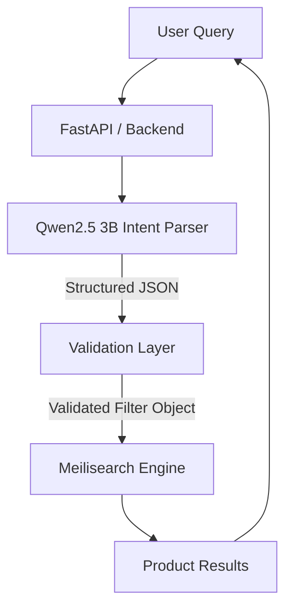

# Ecommerce Intent Parser - Technical Documentation

## 1. Architecture Overview

High-level data flow for the semantic search system.



## 2. Dataset Strategy

### 2.1 Schema Design
The target schema is designed to map directly to Meilisearch filter syntax.

| Field | Type | Description |
|---|---|---|
| `query` | String | Residual keywords for full-text search. |
| `filters` | Object | Strict faceted filters. |
| `filters.brand` | Array | Brand names. |
| `filters.price` | Object | Min/Max ranges in EUR. |
| `in_stock` | Boolean | True if availability is explicitly requested. |

### 2.2 Synthetic Data Generation
We use a deterministic generator to ensure 100% accuracy in training labels.
- **Source**: `generator.py`
- **Logic**: 
    1. Selects random templates (Brand search, Price range, SKU lookup, etc.).
    2. Constructs a natural language query.
    3. Simultaneously constructs the ground truth JSON.
- **Volume**:
    - **100 Baseline Examples**: For testing model performance before/after fine-tuning.
    - **200 Training Examples**: High-quality, diverse examples for QLoRA fine-tuning.

## 3. Fine-Tuning Strategy (QLoRA)

Target Model: **Qwen2.5-3B-Instruct**

### 3.1 Configuration
Recommended LoRA parameters for efficient training on consumer hardware (e.g., RTX 3090/4090).

```yaml
lora_r: 16
lora_alpha: 32
lora_dropout: 0.05
bias: "none"
task_type: "CAUSAL_LM"
target_modules: ["q_proj", "k_proj", "v_proj", "o_proj", "gate_proj", "up_proj", "down_proj"]
learning_rate: 2e-4
num_train_epochs: 3
batch_size: 4
gradient_accumulation_steps: 4
max_seq_length: 512
optim: "paged_adamw_32bit"
```

### 3.2 Training Command (Unsloth / HuggingFace)
```bash
python train_lora.py \
  --model_name "Qwen/Qwen2.5-3B-Instruct" \
  --data_path "training_data.jsonl" \
  --output_dir "./qwen-intent-lora" \
  ...
```

## 4. Production Deployment

### 4.1 System Prompt
See `system_prompt.txt` for the exact prompt instructions.  
**Key Principle**: Strict JSON enforcement. The prompt emphasizes "No markdown" and "Strict JSON" to ensure the output can be parsed by `json.loads()` directly.

### 4.2 Inference with llama.cpp
Run the model as a local API server.

```bash
./server -m models/qwen2.5-3b-finetuned.gguf -c 2048 --host 0.0.0.0 --port 8080
```

## 5. Automated Workflow (Lifecycle Scripts)

We have provided strictly automated scripts to manage the full lifecycle.

### 5.1 Baseline Evaluation (First Pass)
Before fine-tuning, run the evaluation against your base model (served via llama.cpp).

```bash
# Ensure local llama.cpp server is running on port 8080
python evaluate.py --url http://localhost:8080/v1/chat/completions
```
**Output**: `eval_results_TIMESTAMP.json` (Contains accuracy stats and failed queries).

### 5.2 Fine-Tuning
Run the automated QLoRA training script. This uses `unsloth` for maximum efficiency (2x faster, 60% less memory).

```bash
# Install dependencies
pip install unsloth torch datasets trl

# Run training
python finetune.py
```
**Output**: 
- Adapters in `qwen2.5-intent-lora/`
- GGUF models (q4_k_m) automatically exported to `qwen2.5-intent-lora/` ready for llama.cpp.

### 5.3 Re-Evaluation
After training, restart your llama.cpp server with the NEW GGUF model and run evaluation again.

```bash
# Restart server with new model
./server -m qwen2.5-intent-lora/ggml-model-q4_k_m.gguf ...

# Run evaluation again
python evaluate.py
```

## 6. Validation & Evaluation

### 6.1 Metrics
The `evaluate.py` script calculates:
- **Valid JSON Rate**: Percentage of responses that are parseable JSON.
- **Latency**: Average time per query.

You should manually review `eval_results_*.json` to check semantic accuracy (did it extract "under 500" correctly?).

## 7. Performance Optimization
- **Quantization**: Use Q4_K_M or Q5_K_M GGUF format for production to reduce memory usage (< 3GB VRAM) while maintaining accuracy.
- **Caching**: Cache identical queries in Redis to avoid LLM inference latency ~200ms.
- **Constrained Grammar**: Use `llama.cpp` grammar (`--grammar-file json.gbnf`) to forcefully restrict output to valid JSON, eliminating syntax errors.
